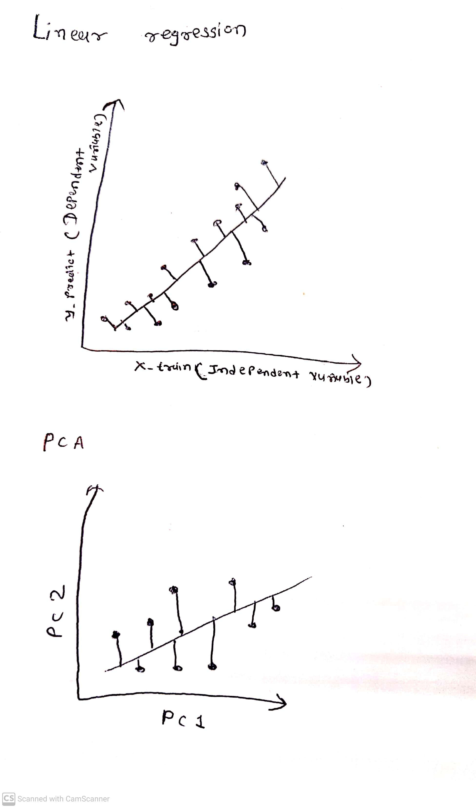

# Part 1. PCA vs Linear Regression (6 points).

Let's say we have two 'features': let one be $x$ and another $y$.
Recall that in linear regression, we are looking to get a model like:


$$y_i=\beta_0+\beta_1*x_i+\varepsilon_i$$

after the fitting, for each data point we would have:
$$y_i=\hat{\beta_0}+\hat{\beta_1}*x_i+r_i$$
where $r_i$ is residual. It can be rewritten as:

$$\hat{\beta_0}+r_i=y_i-\hat{\beta_1}*x_i\;\;\;\;\;(1)$$

The first principal component $z_1$ calculated on $(x,y)$ is
$$z_{i1}=\phi_{i1}y_i+\phi_{i1}x_i$$
Dividing it by $\phi_{i1}$:
$$\frac{z_{i1}}{\phi_{i1}}=y_i+\frac{\phi_{i1}}{\phi_{i1}}x_i\;\;\;\;\;(2)$$

There is a functional resemblance between equations (1) and (2) (described linear relationship between $y$ and $x$). Is the following true:

$$\hat{\beta_0}+r_i=\frac{z_{i1}}{\phi_{i1}}$$
$$\frac{\phi_{i1}}{\phi_{i1}}=-\hat{\beta_1}$$
**Answer**: *No*


What is the difference between linear regression coefficients optimization and first PCA calculations?


**Answer**: 
*(here should be the answer. help yourself with a plot)*

Linear regression is used to find the best-fit line that describes the relationship between the variables. it is calculated by the values of the regression coefficients, which represent the slope and intercept of the line. The coefficients are calculated using the method of least squares, which minimizes the sum of the squared differences between the observed and predicted values.

While PCA is a technique used to reduce the dimensionality of a dataset by identifying the principal components that explain the most variance in the data. The goal of PCA is to transform the original data into a new set of variables that are uncorrelated and have fewer dimensions.

In linear regression, the coefficients are calculated using the method of least squares and mostly used to minimize sum of squared error between actual output y and predicted y values. In PCA, the principal components are calculated using eigenvectors and eigenvalues of the covariance matrix of the original data.it focuses on minimizing the dimensionality of data, but still maintaining real important features of data. Below are graphs, showing uses these two different terms:

``````{r, fig.width=4, fig.height=2}

```


# Part 2. PCA Exercise (27 points).

In this exercise we will study UK Smoking Data (`smoking.R`, `smoking.rda` or `smoking.csv`):

**Description**

Survey data on smoking habits from the UK. The data set can be used for analyzing the demographic characteristics of smokers and types of tobacco consumed.

**Format**

A data frame with 1691 observations on the following 12 variables.

`gender` - Gender with levels Female and Male.

`age` - Age.

`marital_status` - Marital status with levels Divorced, Married, Separated, Single and Widowed.

`highest_qualification` - Highest education level with levels A Levels, Degree, GCSE/CSE, GCSE/O Level, Higher/Sub Degree, No Qualification, ONC/BTEC and Other/Sub Degree

`nationality` - Nationality with levels British, English, Irish, Scottish, Welsh, Other, Refused and Unknown.

`ethnicity` - Ethnicity with levels Asian, Black, Chinese, Mixed, White and Refused Unknown.

`gross_income` - Gross income with levels Under 2,600, 2,600 to 5,200, 5,200 to 10,400, 10,400 to 15,600, 15,600 to 20,800, 20,800 to 28,600, 28,600 to 36,400, Above 36,400, Refused and Unknown.

`region` - Region with levels London, Midlands & East Anglia, Scotland, South East, South West, The North and Wales

`smoke` - Smoking status with levels No and Yes

`amt_weekends` - Number of cigarettes smoked per day on weekends.

`amt_weekdays` - Number of cigarettes smoked per day on weekdays.

`type` - Type of cigarettes smoked with levels Packets, Hand-Rolled, Both/Mainly Packets and Both/Mainly Hand-Rolled

Source
National STEM Centre, Large Datasets from stats4schools, <https://www.stem.org.uk/resources/elibrary/resource/28452/large-datasets-stats4schools>.

Obtained from <https://www.openintro.org/data/index.php?data=smoking>

## Read and Clean the Data

2.1 Read the data from smoking.R or smoking.rda (3 points)
> hint: take a look at source or load functions
>       there is also smoking.csv file for a refference

```{r setup, results="hide", warning=F, message=F}
# load libraries
if (!require("tibble")) install.packages("tibble")
if (!require("readr")) install.packages("readr")
if (!require("broom")) install.packages("broom")
if (!require("ggplot2")) install.packages("ggplot2")
if (!require("ISLR2")) install.packages("ISLR2")
if (!require("ggbiplot")) {
  if (!require("devtools")) install.packages("devtools")
  devtools::install_github("vqv/ggbiplot")
}

library(tibble)
library(readr)
library(dplyr)

library(broom)
library(cowplot)

library(ggplot2)
library(ggbiplot)
library(fastDummies)
library(tidyverse)
library(plotly)
```

```{r}
# Load data
data <- load("smoking.rda")
```

Take a look into data
```{r}
# place holder
glimpse(smoking)
```

There are many fields there so for this exercise lets only concentrate on 
smoke, gender, age, marital_status, highest_qualification and gross_income.

Create new data.frame with only these columns.

```{r}
# place holder
df = smoking %>%  dplyr::select(smoke, gender, age, marital_status, 
                                highest_qualification, gross_income)
glimpse(df)
```


2.2 Omit all incomplete records.(3 points)

```{r}
# place holder
df$gross_income[df$gross_income %in% c("Unknown", "Refused")] <- NA

# Remove rows with NA values in dataframe
df <- na.omit(df)
df
```

2.3 For PCA feature should be numeric. Some of fields are binary (`gender` and `smoke`) 
and can easily be converted to numeric type (with one and zero).
Other fields like `marital_status` has more than two categories, convert
them to binary (i.e. is_married, is_devorced). Several features in the data 
set are ordinal (`gross_income` and `highest_qualification`), convert them 
to some king of sensible level (note that levels in factors are not in order). 
(3 points)


```{r}
# place holder
df$smoke <- as.numeric(df$smoke == "No")
df$gender <- ifelse(df$gender == "Male", 1, 0)

# create new column with 1s and 0s
df$is_married <- ifelse(df$marital_status == "Married", 1, 0)
df$is_Divorced <- ifelse(df$marital_status == "Divorced", 1, 0)
df$is_Single <- ifelse(df$marital_status == "Single", 1, 0)
df$is_Widowed <- ifelse(df$marital_status == "Widowed", 1, 0)

# remove original column
df <- df[, -which(names(df) == "marital_status")]

category_map <- c(`No Qualification`=0, `GCSE/O Level`=1, `GCSE/CSE`=1,
                  `Other/Sub Degree`=1, `ONC/BTEC`=1, `A Levels`=1, 
                  `Higher/Sub Degree` =1, Degree=2)

# Use mutate function from dplyr to add new column with mapped numeric values
df <- df %>% 
 dplyr:: mutate(highest_qualification = category_map[highest_qualification])

df$gross_income <- factor(df$gross_income, levels = c('Under 2,600', '2,600 to 5,200',
                                                      '5,200 to 10,400', '10,400 to 15,600',
                                                      '15,600 to 20,800', '20,800 to 28,600',
                                                      '28,600 to 36,400', 'Above 36,400'))

# Map the categorical values to sequential values using as.numeric()
df$gross_income <- as.numeric(df$gross_income)

# Print the modified data frame
df
```

2.4. Do PCA on all columns except smoking status. (3 points)

```{r}
# place holder
rectified_df <- df[ , -1]
pca <- prcomp(rectified_df)
summary(pca)
```

2.5 Make a scree plot (3 points)

```{r}
# place holder
plot(pca, type = "l", main = "Scree Plot")
```
Comment on the shape, 
if you need to reduce dimensions home many would you choose


```
From the given scree plot, it can be deduced that I need to reduce dimension 
by 8 features. From the cumulative proportion, it can be seen that 98.67% data
is covered by first PC only. So,it would be palusible to abandon the rest features. 

```

2.6 Make a biplot color points by smoking field. (3 points)

```{r}
# place holder
ggbiplot(pca, groups = as.factor(df$smoke), 
         var.axes = TRUE) +
  
  # Map the 'smoke' column values to color aesthetic
  aes(color = smoke) +
  
  # Define the color scale
  scale_color_manual(values = c("yellow", "black"))
```

Comment on observed biplot.

```
--> It can be seen from the biplot that data points are divided into 8 different 
size of clusters very separate to eachother. variables like groass_income,gender, 
is_married are relying on PC1,while highest_qualification, is_widowed, is_divorced
etc are highly correlated to eachother because angle between them are really small,
their value lie on PC2 axis. age attribute is making major impacts on classifying 
smoke data. I have arranged smoke attribute value to yellow color so it can be 
easily notify.
```

Can we use first two PC to discriminate smoking?

```
--> From the biplot, It can be stated that smoking status can not be discriminated 
by first two PC, because data points are not linearly separable or easily classsified.
```

2.7 Based on the loading vector can we name PC with some descriptive name? (3 points)

```
--> In this case, it can be visualized from the graph that marriage status 
related datapoints are heavily dependent upon PC1. so we can describe PC1 as 
marital_status at some level.
```

2.8 May be some of splits between categories or mapping to numerics should be 
revisited, if so what will you do differently? (3 points)

```
--> If I need to change some categorical values, then I will different values to 
all highest_qualification criteria to be more specific, rather than assigning same
values to group of values.
```

2.9 Follow your suggestion in 2.10 and redo PCA and biplot (3 points)

```{r}
# place holder
new_df = smoking %>%  dplyr::select(smoke, gender, age, marital_status,
                                highest_qualification, gross_income)
new_df$gross_income[new_df$gross_income %in% c("Unknown", "Refused")] <- NA

# Remove rows with NA values in dataframe
new_df <- na.omit(new_df)
new_df$smoke <- as.numeric(new_df$smoke == "No")
new_df$gender <- ifelse(new_df$gender == "Male", 1, 0)

# create new column with 1s and 0s
new_df$is_married <- ifelse(new_df$marital_status == "Married", 1, 0)
new_df$is_Divorced <- ifelse(new_df$marital_status == "Divorced", 1, 0)
new_df$is_Single <- ifelse(new_df$marital_status == "Single", 1, 0)
new_df$is_Widowed <- ifelse(new_df$marital_status == "Widowed", 1, 0)

# remove original column
new_df <- new_df[, -which(names(new_df) == "marital_status")]

category_map <- c(`No Qualification`=0, `GCSE/O Level`=1, `GCSE/CSE`=2,
                  `Other/Sub Degree`=3, `ONC/BTEC`=4, `A Levels`=5, 
                  `Higher/Sub Degree` =6, Degree=7)

# Use mutate function from dplyr to add new column with mapped numeric values
new_df <- new_df %>% 
 dplyr:: mutate(highest_qualification = category_map[highest_qualification])

new_df$gross_income <- factor(new_df$gross_income, levels = c('Under 2,600', '2,600 to 5,200',
                                                      '5,200 to 10,400', '10,400 to 15,600',
                                                      '15,600 to 20,800', '20,800 to 28,600',
                                                      '28,600 to 36,400', 'Above 36,400'))

# Map the categorical values to sequential values using as.numeric()
new_df$gross_income <- as.numeric(new_df$gross_income)
```

```{r}
df_rec <- new_df[ , -2]
pca3 <- prcomp(df_rec)
summary(pca3)
```

```{r}
plot(pca3, type = "l", main = "Scree Plot")
```
```{r}
ggbiplot(pca3, groups = as.factor(df$smoke), 
        var.axes = TRUE) +
        aes(color = smoke) +
        scale_color_manual(values = c("yellow", "black"))
```

# Part 3. Freestyle. (27 points).

Get the data set from your final project (or find something suitable). The data 
set should have at least four variables and it shouldn't be used in class PCA 
examples: iris, mpg, diamonds and so on).

* Convert a columns to proper format (9 points)
* Perform PCA (3 points)
* Make a skree plot (3 points)
* Make a biplot (3 points)
* Discuss your observations (9 points)


```{r}
data = read.csv('stroke_data.csv')
glimpse(data)
```


```{r}
dframe = data %>%  dplyr::select(gender, age, hypertension, heart_disease, 
                                 ever_married, work_type, Residence_type, 
                                 avg_glucose_level, bmi, smoking_status, stroke)
glimpse(dframe)
```


```{r}
#omit null value
dframe <- dframe[- grep("N/A", dframe$bmi),]
```

```{r}
#Convert a columns to proper format

dframe$gender <- ifelse(dframe$gender == "Male", 1, 0)

# create new column with 1s and 0s
dframe$ever_married <- ifelse(dframe$ever_married == "Yes", 1, 0)

category_map <- c("Private"=0, "Self-employed" = 1, "Govt_job"= 2, 
                  "children" = 3, "Never_worked" = 4)
# Use mutate function from dplyr to add new column with mapped numeric values
dframe <- dframe %>% dplyr:: mutate(work_type = category_map[work_type])

dframe$is_rural <- ifelse(dframe$Residence_type == "Rural", 1, 0)
# remove original column
dframe <- dframe[, -which(names(dframe) == "Residence_type")]

dframe <- transform(dframe, bmi = as.numeric(bmi))

smoke_map <- c(`never smoked`=0, `formerly smoked`=1, `smokes`=2, `Unknown`=3)
# Use mutate function from dplyr to add new column with mapped numeric values
dframe <- dframe %>% dplyr:: mutate(smoking_status = smoke_map[smoking_status])
glimpse(dframe)
```

```{r}
#Perform PCA
pca1 <- prcomp(dframe)
summary(pca1)
```

```{r}
#Make a skree plot
plot(pca1, type = "l", main = "Scree Plot")
```

```{r}
#Make a biplot
ggbiplot(pca1, groups = as.factor(dframe$stroke), 
         var.axes = TRUE) +
  
  # Map the 'stroke' column values to color aesthetic
  aes(color = stroke) +
  
  # Define the color scale
  scale_color_manual(values = c("yellow", "black"))
```

```
#Discuss your observations
--> It can be deduced from the cumulative proportion that the elbow point appears
to be at the third component. This suggests that there should retain the first 
three components, as they capture the majority of the variation in the data. The 
remaining components do not contribute significantly to the overall variability 
of the data and can be discarded.Its covering 99.87% principle components.

--> From biplot data, it can be observed that variables like work_type, 
smoking_status are highly  correlated, while While, ever_married, hypertension, 
heart_disease are also correlated and are explicitly opposite of these. 
avg_glucose_level has significant impact upon making decision for prediction of 
stroke.

--> stroke datapoints can be easily classify into 2 categories so they are 
linearly separable.
```


